Description of DIESEL
=====================

Here, we give a brief summary of DIESEL. More detailed information will
be given later, in the various parts of the lab assignment. As DIESEL
has much in common with Pascal and Modula-2, we will make use of them
and point out differences from them, particularly when there is
ambiguity.

Declarations
------------

A program in DIESEL starts just as in Pascal, but you can not write file
specifications such as (input, output) .

Declaring constants
~~~~~~~~~~~~~~~~~~~

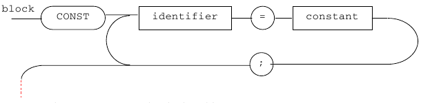

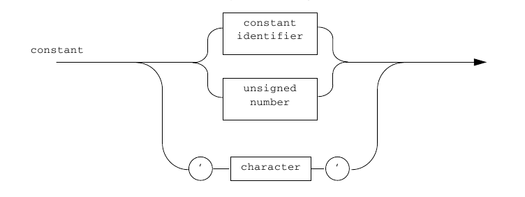

Constant definitions such as:

.. code-block :: pascal

      const
         SIZE = 10;
         PI = 3.14159;
         BUF_MAX = SIZE;

give names to numbers. Note the distinction between the *number*
``10`` and the *constant* ``SIZE``. Both are of *integer* type.

Furthermore, string constants can be declared in DIESEL but you are not allowed to use them [1]_:

.. code-block :: pascal

      const
         version = 'version 1.1';

Unlike Pascal, numerical constants can only have non-negative values:

Declaring Variables
~~~~~~~~~~~~~~~~~~~

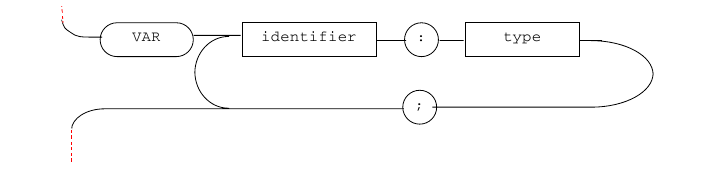

.. figure:: pics/diesel_1_types.png
   :alt: State machine of lexical definition for types

DIESEL has no mechanism for creating new types and thus has no type–
construction. This, and also the absence of records and pointers, is the
main weakness of DIESEL. ``boolean`` and ``char`` do not exist either,
but fortunately ``integer`` and ``real`` do. Variables can be declared
as one of the simple types or an ``array`` of these:

.. code-block :: pascal

      var
         i : integer;
         a : array[10] of real;

Note that you cannot write:

.. code-block :: pascal

      var
         i, j : integer; { wrong! }

Only one-dimensional arrays exist. These are indexed by integers. In the
example above the index can vary between ``0`` and ``9`` (i.e.
there are ``10`` elements). The operations allowed on arrays are
assignment and reference of elements. Arrays cannot be used as
parameters to procedures or functions.

Boolean values are simulated by integers where ``0`` represents
``false`` and everything else ``true``.

Declaring functions and procedures
~~~~~~~~~~~~~~~~~~~~~~~~~~~~~~~~~~

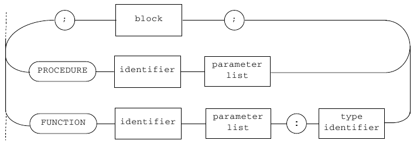

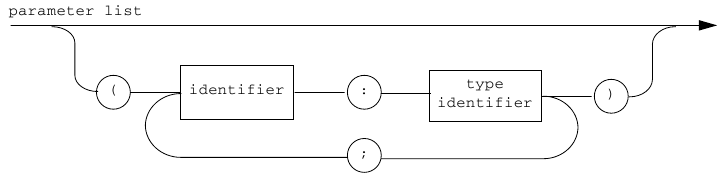

DIESEL provides both functions and procedures. These can be nested
arbitrarily and they can be recursive. As there is no forward
construction, mutual recursion is a little more difficult, but can be
achieved by placing one function or procedure inside another.

Functions can return values of the integer or real types whereas procedures
do not return a value.
It is possible to send expressions of the integer or real types as
actual parameters. These are bound to the formal parameters according to
the call-by-value principle, i.e. the called function or procedure can
not modify the values of the actual parameters.

The same restriction applies here as to the declaration of variables;
the following is wrong:

.. code-block :: pascal

      procedure p(i, j : integer; x, y : real); {wrong!}

and should be written as:

.. code-block :: pascal

      procedure p(i : integer; j : integer; x : real; y : real);

Finally, after all the declarations, we come to the main program:

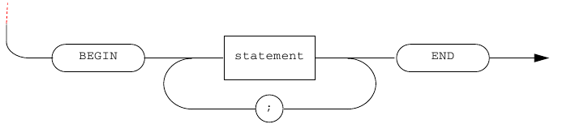

Statements
----------

Assignments
~~~~~~~~~~~

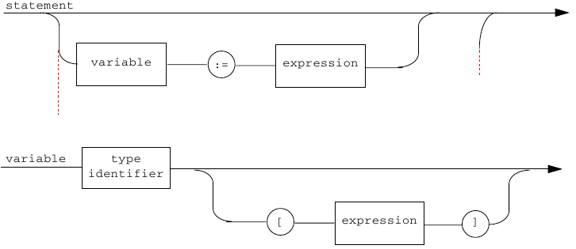

You can assign values to variables, and to elements in an array.

Type conflicts arise if the variable is of the integer type but the
expression results in a floating-point number. However, type conversion
is carried out in the following assignment:

.. code-block :: pascal

      var
         x : real;
      begin
         x := 3;
      end;

This is the same rule as in Pascal.

Procedure calls
~~~~~~~~~~~~~~~

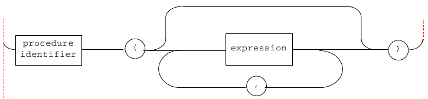

Calling a procedure is carried out in the same way as in Pascal with one
important exception: the parentheses must always be written out. The
same applies to functions.

There is a pre-defined procedure, write, which takes an argument
(integer) interpreted as ASCII and prints it on the screen. For example,

.. code-block :: pascal

      write(48);

prints a zero. Procedures for writing integers and floating-point
numbers are written in the language and can be found in the appendix.

Conditionals
~~~~~~~~~~~~

DIESEL uses the same syntax for conditional statements as Modula-2:

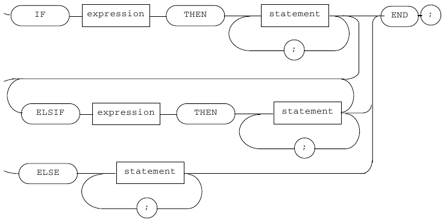

.. table:: Differences between DIESEL and PASCAL for conditional instructions.

   +------------------------+--------------------------+
   | DIESEL                 | PASCAL                   |
   +========================+==========================+
   | ::                     | ::                       |
   |                        |                          |
   |       if a > b then    |       if a > b then      |
   |          c := d;       |          c := d;         |
   |       end;             |                          |
   |                        |                          |
   +------------------------+--------------------------+
   | ::                     | ::                       |
   |                        |                          |
   |       if a > b then    |       if a > b then      |
   |          c := d;       |       begin              |
   |          e:= f;        |          c := d;         |
   |       else             |          e := f;         |
   |          g := h;       |       end                |
   |       end;             |       else               |
   |                        |          g := h;         |
   |                        |                          |
   +------------------------+--------------------------+
   | ::                     | ::                       |
   |                        |                          |
   |       if a > b then    |       if a > b then      |
   |          c := d;       |       begin              |
   |          e := f;       |          c := d;         |
   |       elsif g > h then |          e := f;         |
   |          i := j;       |       end                |
   |          k := l;       |       else if g > h then |
   |       elsif m > n then |       begin              |
   |          o := p;       |          i := j;         |
   |       else             |          k := l;         |
   |          q := r;       |       end                |
   |          s := t;       |       else if m > n then |
   |       end;             |          o := p;         |
   |                        |       else               |
   |                        |       begin              |
   |                        |          q := r;         |
   |                        |          s := t;         |
   |                        |       end;               |
   |                        |                          |
   +------------------------+--------------------------+

Repetition
~~~~~~~~~~

The only repetition statement in DIESEL is while:

.. figure:: pics/diesel_1_while.png
   :alt: State machine of lexical definition for repetitions.

Note that the while-statement, like the if-statement, always finishes
with an end without an introductory begin.

Examples:

.. table:: Comparing ``while`` instructions between DIESEL and PASCAL.

   +----------------------+-----------------------+
   | DIESEL               | PASCAL                |
   +======================+=======================+
   | ::                   | ::                    |
   |                      |                       |
   |       while a > b do |        while a > b do |
   |          c := d;     |          c := d;      |
   |       end;           |                       |
   |                      |                       |
   +----------------------+-----------------------+
   | ::                   | ::                    |
   |                      |                       |
   |       while a > b do |       while a > b do  |
   |          c := d;     |       begin           |
   |          e := f;     |          c := d;      |
   |       end;           |          e := f;      |
   |                      |       end;            |
   |                      |                       |
   +----------------------+-----------------------+

Return
~~~~~~

In Pascal a function gets its value from an assignment statement where
the function name appears on the left-hand side. In contrast DIESEL has
borrowed the return-statement from Modula-2 which achieves the same
thing.

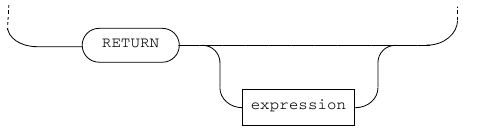

Executing a return-statement means that the function is assigned
the value given by the expression; then the return is performed
immediately. The expression’s type must be assignment compatible with
the declared function name. Example:

::

      function max(a : integer; b : integer) : integer;
      begin
         if a > b then
            return a;
         else
            return b;
         end
      end;

In an ordinary procedure you can have return-statements without a
following expression. Such return-statements act as alternative return
points in the procedure. Example:

::

      procedure down(n : integer);
      begin
         if n = 0 then
            return ;
         else
            down(n-1);
            write_int(n);
            newline();
         end;
      end;

Arithmetic expressions
----------------------

Factors
~~~~~~~

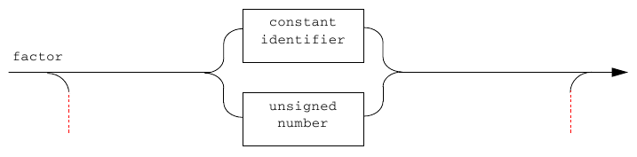
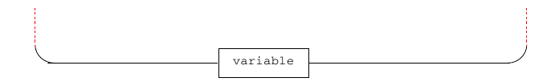
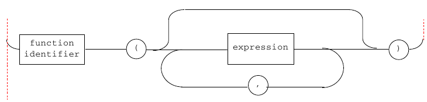
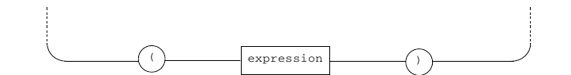
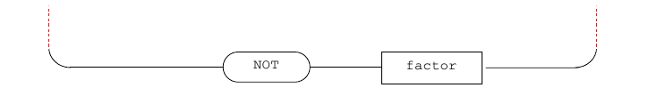

A factor in an arithmetic expression can be a number or a constant, a
variable, the value of a function (note the obligatory
parentheses), an expression in parentheses, or a logical negation.

There are two standard functions that deal with arithmetics:

-  ``read`` takes no arguments but returns the next input character as an
   integer (ASCII). Example:

   ::

         var
            i : integer;
         begin
            i := read();
         end;

-  ``trunc`` transforms floating-point numbers to integers by truncation.
   Example:

   ::

         var
            i : integer;
         begin
            i := trunc(3.7);
         end;

   which assigns the value ``3`` to ``i``.

Terms
~~~~~

Terms can be built from factors:

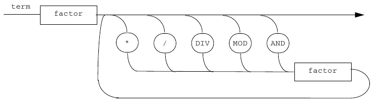

Note that ``DIV`` is an integer operation and is defined only for integer
arguments. Also note that ``/`` always returns a floating-point result,
even if it is used with integer arguments. Boolean numbers are integer
values and therefore boolean operations only accept integer operands.
Their results should be either ``1`` (``true``) or ``0``
(``false``).

Simple expression
~~~~~~~~~~~~~~~~~

Simple expressions are built out of terms:

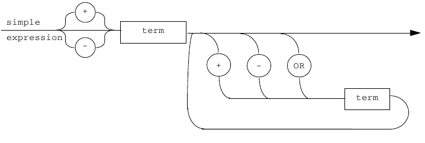

Expressions
~~~~~~~~~~~

Finally, an arithmetic expression can be either a simple expression
or a logical comparison of two simple expressions. In the latter case
the result will be an integer value of ``1`` or ``0``.

Note that ``<=`` and ``>=`` do not exist.

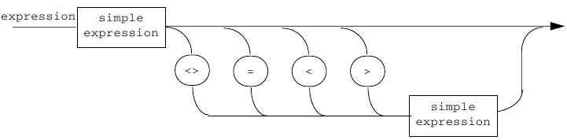

stdio.d
-------

Listing of some standard I/O functions in DIESEL.

.. literalinclude:: ../../code/testpgm/stdio.d
  :language: pascal
  :linenos:

.. [1]
   The aim is to make the lexical analysis a little more interesting.
