Lab 2 : Symbol Table
====================

.. default-domain:: cpp

In this lab, you will write functions to administrate a symbol table. If
you are unsure about *scope-rules*, you should read pages
394 - 396 (as far as section 7.2) in the course textbook.

Introduction
------------

In the symbol table information is gathered about the names [1]_ that
appear in the program. The symbol table primarily helps:

* In checking the program’s semantic correctness.

    Using the symbol table you can, for example, determine whether a
    variable has been declared and in that case if it is of an integer or
    floating-point type.

* In generating code.

    The symbol table keeps track, for example, of memory requirements for
    various variables.

Furthermore, the following features are desirable:

* Support for block structures and scope rules, if the language
  requires that.

    In block-structured languages the same identifier can occur several
    times, but in different blocks. The symbol table, therefore, ought to
    be organised so you have access to the variables which are visible at
    a given time.

* Compact storage.

    An implementation requiring little memory is to be aimed for.

* Quick addition of, and searching for names.

    The need to search fast collides (as usual) with memory space demands,
    as mentioned above.

* Resident storage.

    The symbol table may be needed later, if the compiler works in several
    runs, or for diagnosis of execution errors.

The information stored in the symbol table is a list of pairs (*name*,
*attribute*), also often referred to as *bindings*:

Name
  The name forms a search key in the symbol table. A problem which must
  be dealt with is how to efficiently store all significant characters
  in the identifier.

Attributes which are dependent on the language to be compiled
  These include type information, array dimensions, the number of
  parameters in procedures and functions, as well as line numbers for
  declarations.

Attributes which are dependent on the language we are compiling to
  For example, if we are generating machine code, we will have problems
  with references to addresses in memory, whose values are unknown at code
  generation time. If we choose to generate assembler, we can instead
  refer to a so-called label (symbolic position) whose value is determined
  later. Assembler will then perform the translation to absolute addresses
  in memory.

The operations we would like to perform on the symbol tables are:

-  Look up a name

-  Add a new name

-  Add an attribute to a name

-  Retrieve the value of an attribute of a name

-  Remove a name and its associated information

Data structures for symbol tables
~~~~~~~~~~~~~~~~~~~~~~~~~~~~~~~~~

When judging various data structures, the following should be taken into
consideration:

-  Memory space,

-  Time taken to add and search for a name,

-  How difficult it is to introduce scoping.

Linear lists
^^^^^^^^^^^^

Searching is performed in linear fashion from beginning to end. The
search halts as soon as the name you are looking for, is found.

Linear lists are easy to implement and require little memory space.
Scoping is easily introduced using the LIFO principle. However, search
times are unacceptable. Reports have shown that a compiler, which
implements symbol tables using linear lists, can spend 25% of
compilation time on searching.

Trees
^^^^^

The symbol table can be in the form of a tree; then each subprogram has
a symbol table attached to its node in the abstract syntax tree. The
main program has a similar table for globally declared objects. The
advantage of this structure is that it is easy to represent *scoping*
and is quicker than linear lists.

Hashing
^^^^^^^

When high demands are made on the search time, hashing is used. Entry to
the hash table is calculated using a suitable key transformation. If the
symbol is not in the entry, you have to follow the link field. By making
the hash table large enough you can control the search time.

However, extra space is required if you do not want to risk filling the
hash table [2]_. Introducing scoping is somewhat more difficult than for
linear lists and trees.

The symbol table in DIESEL
--------------------------

The symbol table to be implemented, uses hashing with linking. In DIESEL
there are seven different types of symbols: constants, variables,
arrays, parameters (formal), procedures, functions and name types
(``integer``, ``real``, and ``void``). Each symbol type is represented
by a separate class, and all symbols inherit from the abstract class
:class:`symbol`. Let us first examine what information is common to all
symbols (and is found in the :class:`symbol` class):

.. doxygenclass :: symbol
  :members: id, tag, type, hash_link, back_link, level, offset
  :no-link:

There are specialized symbols with additional attributes:

.. doxygenclass :: constant_symbol
  :members: const_value
  :no-link:

.. doxygenclass :: variable_symbol
  :no-link:

.. doxygenclass :: array_symbol
  :members: array_cardinality, index_type
  :no-link:

.. doxygenclass :: parameter_symbol
  :members: size, preceding
  :no-link:

Procedures and functions have identical members but different semantics:

.. doxygenclass :: procedure_symbol
  :members: ar_size, label_nr, last_parameter
  :no-link:

.. doxygenclass :: function_symbol
  :members: ar_size, label_nr, last_parameter
  :no-link:

The symbol table structure
~~~~~~~~~~~~~~~~~~~~~~~~~~

The symbol table itself is made up of an array of pointers to symbol
objects, which belong to one of the classes mentioned above. A symbol is
accessed via its index, a :type:`sym_index`, rather than by a pointer. Why?
To allow us to use hashing.

A variable called :member:`~symbol_table::sym_pos` keeps track of the current position in the
table. It will always contain the index to the last symbol that was
entered into the table. Note that the first element in an array in C++
has index ``0`` (zero).

The symbol table also contains a string pool, where identifiers and
string constants are stored.

A hash table is used for fast access to symbols.

A block table, or *display*, is used to keep track of the current
nesting depth. Read up on displays in the course book. It isn’t really
that complicated once you get the hang of it.

To try to make things clearer, let us study how the symbol table is
constructed step by step.

At the beginning the table is empty:

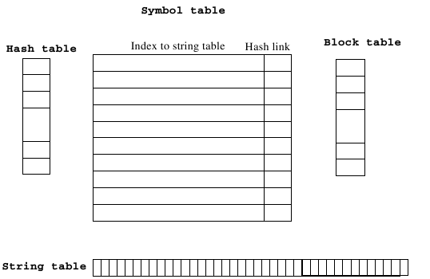

In the diagram, we have chosen (for reasons of space) to show only the attributes we care about right now (:member:`~symbol_table::id` and :member:`~symbol_table::hash_link`).
We assume the following functions exist (see the top of ``symtab.hh`` for some type definitions used here):

.. doxygenclass:: symbol_table
   :project: TDDB44
   :members: install_symbol, lookup_symbol, open_scope, close_scope, string_pool, current_level, block_table
   :no-link:

When creating a new symbol table object, the name types ``global``,
``integer_type``, ``real`` and ``void`` as well as the standard
functions ``trunc`` and ``read``, and the standard procedure ``write``
are installed in the symbol table.

To save space in the examples below, we skip ``global``, ``void``,
``trunc``, and ``integer``; and starts with the name type ``real``
instead. The principle is the same.

How the figures should be read:

+----------------------------------------------------------------------------------+-----------+
| A dotted arrow means that the link is removed in this picture:                   | |dotted|  |
+----------------------------------------------------------------------------------+-----------+
| A dashed arrow means that the link is added in this picture:                     | |dashed|  |
+----------------------------------------------------------------------------------+-----------+
| A normal (filled) arrow means that the link was added in any previous picture:   | |normal|  |
+----------------------------------------------------------------------------------+-----------+

Inserting *REAL* into the empty symbol table:

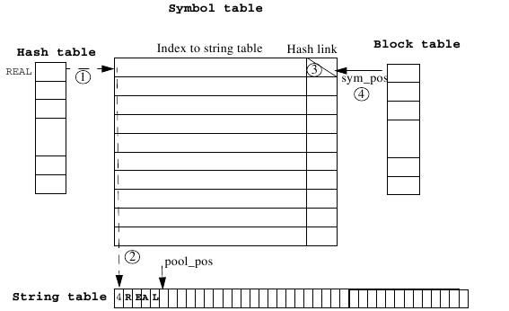

The symbol’s ``real`` :member:`~symbol_table::pool_pos` value is hashed. A symbol of the type
``real`` is created, and it’s index to the string table is set to
``real``\ ’s :member:`~symbol_table::pool_pos` :math:`\textcircled{\raisebox{-0.9pt}{2}}`. Since there is no other
symbol on this position in the hash table the hash link is set to
nothing, i.e., :var:`NULL_SYM` :math:`\textcircled{\raisebox{-0.9pt}{3}}` (this is symbolized by the
diagonal line in the square named hash link) . The index to the symbol
is saved in the hash table :math:`\textcircled{\raisebox{-0.9pt}{1}}`.
The pointer :member:`~symbol_table::sym_pos` is increased by one :math:`\textcircled{\raisebox{-0.9pt}{4}}`.

Step 2:
The symbol ``write`` is installed in the same manner as ``real``
:math:`\textcircled{\raisebox{-0.9pt}{1}}-\textcircled{\raisebox{-0.9pt}{3}}`:

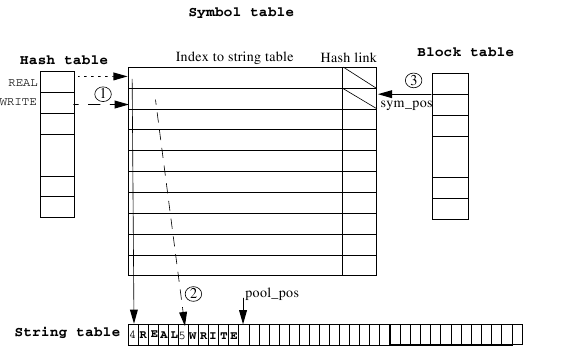

Step 3:
Inserting *READ* into the symbol table and linking back to *REAL*:

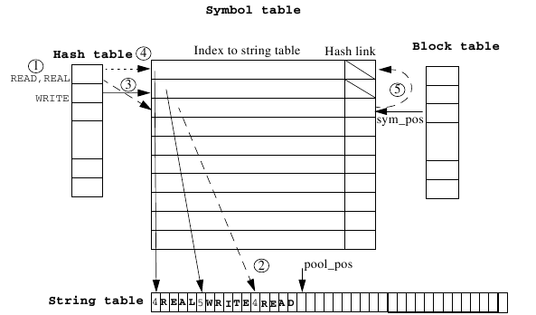

The symbol’s ``read`` :member:`~symbol_table::pool_pos` is hashed and happens to have the
same hash value as ``read``, therefore there is a hash table collision
between ``read`` and ``real`` :math:`\textcircled{\raisebox{-0.9pt}{1}}`.
The symbol is installed and its id is set to the :member:`~symbol_table::pool_pos` value of
``read`` :math:`\textcircled{\raisebox{-0.9pt}{2}}`. The index
to the symbol is saved in the hash table :math:`\textcircled{\raisebox{-0.9pt}{3}}`,
and the previous
index, that pointed to the first symbol (``real``), is lost :math:`\textcircled{\raisebox{-0.9pt}{4}}`.
Since we just can’t throw away ``real``, we set the :member:`~symbol::hash_link` of
``read`` to point to ``real`` :math:`\textcircled{\raisebox{-0.9pt}{5}}`.
We can now find both ``read``
and ``real`` in the symbol table by following the hash link. The
:member:`~symbol_table::sym_pos` variable is increased for every object added, and always
points to the last installed object. The :member:`~symbol_table::pool_pos` variable plays a
similar role for the string table.

We can now start to deal with the program, which is assumed to look like
this:

::

  program prog;
    var a : integer; b : integer; c : integer;
    procedure p1;
      var a : integer;
    begin
      c := b + a;
    end;
  begin
    c := b + a;
  end.

The first identifier to be detected by the scanner is ``prog``. We
install it:

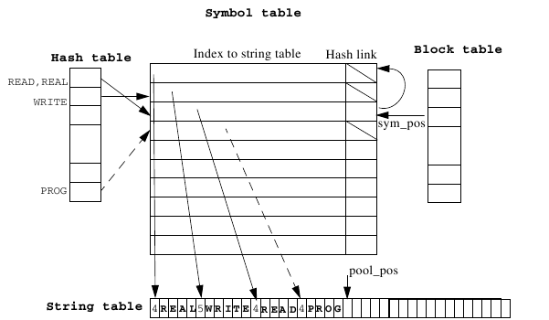

The method that called :func:`~symbol_table::install_symbol` (:func:`~symbol_table::enter_procedure`) sets,
among other things, the tag of ``PROG`` to :enumerator:`SYM_PROC`\  [3]_. This is
immediately followed by a call to :func:`~symbol_table::open_scope()` as a new lexical
level begins; the global level:

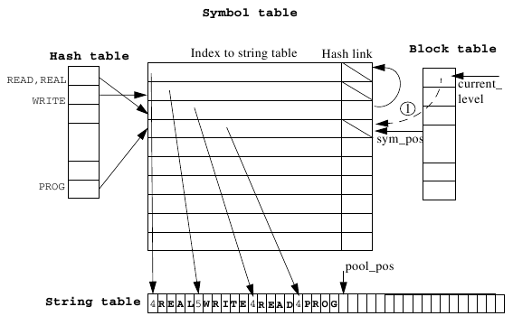

The current lexical level (or depth) is now ``1``. The first element
of the block table now points to the last object inserted :math:`\textcircled{\raisebox{-0.9pt}{1}}`
(the current :member:`~symbol_table::sym_pos` is saved into the block table), which will be
the procedure/function we just entered. This is a convention which means
that we always know which procedure or function we are in, namely:

.. code-block:: c++

  sym_table[block_table[current_level]]

Incidentally, this is identical to:

.. code-block:: c++

  symtab->get_symbol(sym_tab->current_environment())

which is how you can reference the current environment from outside the
symbol table. More about that in the next lab, however.

:member:`~symbol_table::current_level` thus points to the current block level and therefore goes up and down.
When compilation has finished :member:`~symbol_table::current_level` should be the same as when compilation started (zero).

.. admonition:: Exercise

  This exercise is not mandatory, but it helps you understand the
  implementation.

  Assume that ``REAL`` has been stored in the string table (pool table) in
  position ``9``. Work out what happens at the following call:

  .. code-block:: c++

    i := lookup_symbol(9);

The next identifiers to be installed are ``a``, ``b`` and
``c``. All three give rise to collisions during hashing. Therefore
they are all installed in the same manner as ``read``. This
description is valid for all the three pictures: A hash table collision
occurs :math:`\textcircled{\raisebox{-0.9pt}{1}}`.
The symbol is installed and its id is set to the
:member:`~symbol_table::pool_pos` value of the symbol :math:`\textcircled{\raisebox{-0.9pt}{2}}`.
The index to the symbol is
saved in the hash table :math:`\textcircled{\raisebox{-0.9pt}{3}}` and the previous index that pointed
to some other symbol is removed :math:`\textcircled{\raisebox{-0.9pt}{4}}`.
The hash link of the installed symbol is set to point to the other symbol instead
:math:`\textcircled{\raisebox{-0.9pt}{5}}`, which would be lost otherwise.

Installing ``a``:

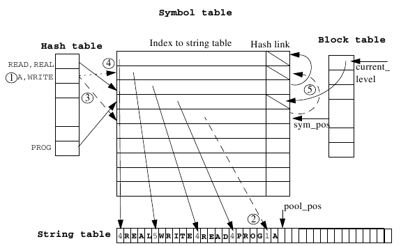

Installing ``b``:

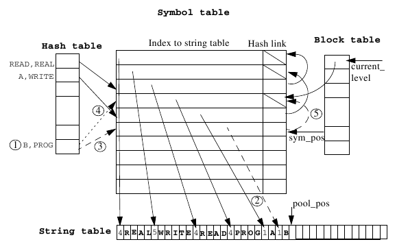

Installing ``c``:

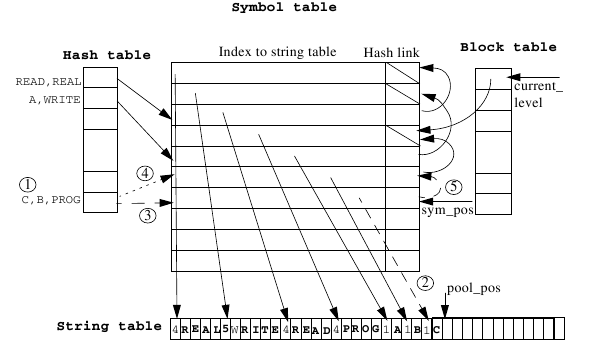

Take a look at how ``prog`` can be found by following the hash links from
``c``. Also, note
how ``write``, which is on another lexical level than the current one,
is still *“visible”* via the hash links.

The next identifier is ``p1``. There is no collision this time and
``p1`` is installed in the same manner as ``real`` and ``write``.
Since ``p1`` is a procedure, :func:`~symbol_table::open_scope()` is called after the
installation. The current lexical level is now ``2`` and the current
:member:`~symbol_table::sym_pos` has been saved in the block table :math:`\textcircled{\raisebox{-0.9pt}{1}}`.

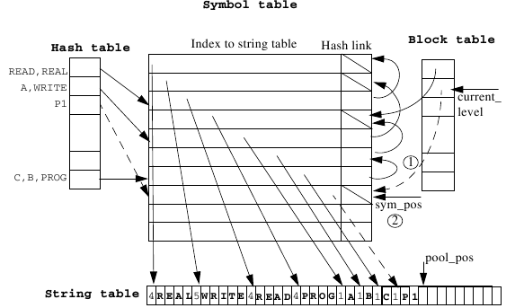

We now have two active blocks. Compilation continues and we find
identifier ``a``. We install it while we start at the scope ``p1``:

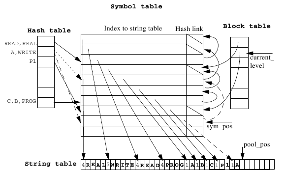

.. admonition :: Exercise

  This exercise is not mandatory, but helpful for understanding the
  implementation.

  There are now two variables called ``a`` in the program. Why is it that
  the ``a`` we just found does not collide with the first one and generate
  the error message *“already declared”*?

After the declaration we find the statement

::

  c := b + a;

which results in three calls to :func:`~symbol_table::lookup_symbol()`:

::

  lookup_symbol(poolindex of c);

We hash ``c`` and follow the index from the hash table to the symbol
table. Is ``c`` there? Yes, return its index in the table (``7``).

::

  lookup_symbol(poolindex of b);

We hash ``b`` and follow the index from the hash table to the symbol
table. Is ``b`` there? No, ``c`` was there so we follow the hash link
backwards. Is ``b`` there? Yes, return its index (``6``).

::

  lookup_symbol(poolindex of a);

We hash ``a`` and follow the index from the hash table to the symbol
table. Is ``a`` there? Yes, return its index (``9``).

We can see, then, how :func:`~symbol_table::lookup_symbol()` always follows the scope rules.
If you didn’t see it, read about scope rules in the course book or the
lecture notes, then look through these figures again.

We now come to the end of procedure ``p1`` and therefore call
:func:`~symbol_table::close_scope()`.

Consider what will happen now. Which symbols in the symbol table will
*“disappear”* and which will remain *“visible”*?

The answer is that ``p1``\ ’s local variable ``a`` will *“disappear”*.
``p1`` itself is still visible (the main program can, of course, call
it).

Now we have to reorganise the symbol table so that :func:`~symbol_table::lookup_symbol()`
does not find ``a``. The algorithm we use is (study with care; this is
important):

.. code-block:: none

  for each symbol from sym_pos down to block_table[current_level] + 1
    if the hash table points to the symbol
      let it instead point to what the symbol points to with its hash link.

There is only one symbol that is affected, the symbol ``a``, which was
recently installed. The symbol is marked with ``'I'`` in the following figure.
Follow the
back link from the symbol or rehash its id to find out which index in
the hash table that is to be changed :math:`\textcircled{\raisebox{-0.9pt}{1}}`.
Follow the hash link from ``a`` :math:`\textcircled{\raisebox{-0.9pt}{2}}`.
Save the index of the symbol that was found at
the end of the hash link in the hash table :math:`\textcircled{\raisebox{-0.9pt}{3}}`
on the position found in :math:`\textcircled{\raisebox{-0.9pt}{1}}`.
The previous index is of course lost :math:`\textcircled{\raisebox{-0.9pt}{4}}`.
The hash link of the affected symbol must be set to :var:`NULL_SYM`
:math:`\textcircled{\raisebox{-0.9pt}{5}}`. At last, close the scope
:math:`\textcircled{\raisebox{-0.9pt}{6}}`.

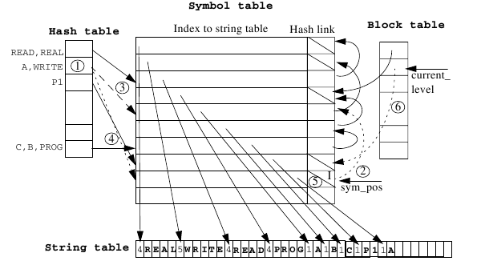

The symbol table look like this when the scope of ``p1`` is closed:

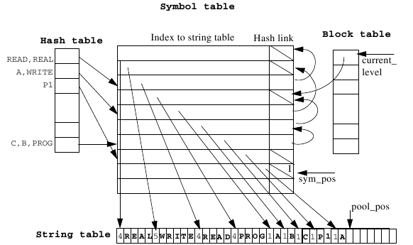

The condition as to whether *the hash table points to the object* can
only be answered by searching the whole hash table or re-hashing. We can
avoid this by placing a backward pointer in the symbol table. If
:func:`~symbol_table::install_symbol` really does install, it sets the backward pointer
to the hash index which was obtained at the key transformation. Use this
feature if you want to. This lab can be solved without using it if
desired.

We have now reached the main program which consists of the line:

::

  c := b + a;

Convince yourself that :func:`~symbol_table::lookup_symbol()` follows the scope rules.

Finally we find end and call :func:`~symbol_table::close_scope()` again.
The symbols which are affected this time are marked ``I-V``.

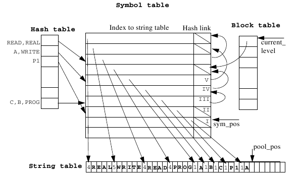

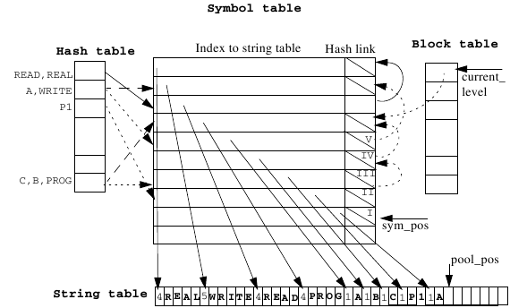

Symbol ``II``\ ’s (``p1``\ ’s) hash link points to :var:`NULL_SYM`
and therefore the arrow from the hash table is removed (i.e. points to
:var:`NULL_SYM`). Symbol ``III``\ ’s (``c``\ ’s) hash link points to
symbol ``IV`` (``b``) which makes the arrow from ``c``, ``b``,
``prog`` point to symbol ``IV`` instead. In the next step the
pointer from ``c``, ``b``, ``prog`` is set to the symbol prog. Symbol
``V`` (``a``) makes the pointer from ``a``, ``write`` point to the
symbol ``write``.

The final result:

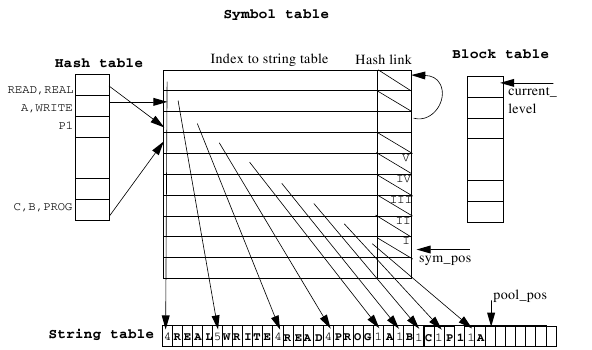

Observations
^^^^^^^^^^^^

One detail has been left out on purpose. When we scanned the statement
``c := b + a`` new copies of ``c``, ``b`` and a should have been
inserted in the string table (but only there!). It would be smarter to
check whether a was already in the string table before installation. If
it is, you can *“share”* its index. This is left as an extra exercise.
If you want to implement this, you will need to change your
``scanner.l`` file slightly (hint: The method :func:`~symbol_table::pool_forget()` might be
useful if you do).

If you want to save even more space in the string table, you can use the
observation that names that have been defined in a block that has
already been parsed are no longer visible. Hence you can move
:member:`~symbol_table::pool_pos` back to the position which applied before the block.

This is not appropriate if you want to save the symbol table (why would
you want to do this?).

A relatively expensive operation is the comparison made between
identifiers at collisions in the hash table. If you are prepared to only
have six significant characters for identifiers, you can get rid of the
string table completely and code the six characters as a 32-bit
integer (as letters and digits can be coded as numbers less than
40 and 40⁶ < 2³²).
Other options include using a tree instead of a linked list (making
conflicts cheaper, but adding variables and closing a scope more expensive),
or increasing the size of the hash table and the quality of the hashing algorithm
(resulting in fewer conflicts).

Implementation
--------------

Before you start with the implementation read :ref:`lab2_files_to_change` and :ref:`lab2_files_of_interest`;
you might also want to skim through the other sections for some useful hints.

You are to do four things:

Write the methods :func:`~symbol_table::open_scope` and :func:`~symbol_table::close_scope`.
They are called upon entering and leaving an environment (i.e., a
procedure/function) respectively.

Write the method :func:`~symbol_table::lookup_symbol`. Given a :type:`pool_index` to a
symbol, you should search from the innermost (current) environment and
outwards, to see if such a symbol exists. If it does, return its
:type:`sym_index`. Otherwise, return :var:`NULL_SYM`. Note that if you choose
to implement shared strings (see the non-mandatory exercise above) the
scanner will have to call this method. When?

Write the method :func:`~symbol_table::install_symbol`. Given the :type:`pool_index`
of a symbol, and a :type:`sym_type` tag, you should create and install the
correct symbol type in the symbol table. If a symbol with the same
identifier already was installed on this lexical level, you shouldn’t
re-install it but instead return its :type:`sym_index`. This method is the
biggest part of this lab. Remember that there is a superclass symbol
from which all the various concrete symbol classes are derived. You will
need to instantiate the correct symbol class and initialize the various
symbol attributes: :member:`~symbol::back_link` (if you use it),
:member:`~symbol::id`,
:member:`~symbol::hash_link`,
:member:`~symbol::level`,
:member:`~symbol::offset`, and
:member:`~symbol::tag` (:member:`~symbol::tag` will be set
to :enumerator:`SYM_UNDEF` in the symbol constructor when creating a new symbol).
The second argument to :func:`~symbol_table::install_symbol` is used to find out which
symbol class to install. If any of the tables becomes filled,
:func:`fatal()` must be called.

Write the method :func:`~symbol_table::enter_procedure()`. You can get a lot of help from
looking at the pre-written method :func:`~symbol_table::enter_function()`; they will be
very similar. One thing you will need to do in this method is a safe
down-casting from class symbol to subclass :class:`procedure_symbol`. Look at
:func:`~symbol_table::enter_function()` to see how this is done. If it is still confusing,
ask your lab assistant. The technique of safe down-casting in this way
will be used in many more places throughout this lab course, so you
might as well spend the time to understand it right away.

.. _lab2_files_to_change:

The files you need to change
~~~~~~~~~~~~~~~~~~~~~~~~~~~~

symtab.cc
    contains the symbol table implementation. This is the file you will
    need to edit to complete this lab.

scanner.l
    flex input file.
    Unless you choose to implement shared strings (not mandatory),
    you should not need to edit this file any further
    (assuming you got it right in the previous lab, of course).

.. _lab2_files_of_interest:

Other files of interest
~~~~~~~~~~~~~~~~~~~~~~~

Note: *Other than the Makefile, use the same files you were given in the
first lab.*

symtab.hh
    contains all definitions concerning symbols and the symbol table.

symbol.cc
    contains the symbol class implementations.

error.hh error.cc
    global error and debug routines.

symtabtest.cc
    used for testing. Edit this file to simulate various calls to the
    symbol table. See the comments in the file for more information.

Makefile
    this is not the same as in the first lab!

.. _lab2_decl_routines:

Declarations and routines available in *symtab.hh*, *symtab.cc*
~~~~~~~~~~~~~~~~~~~~~~~~~~~~~~~~~~~~~~~~~~~~~~~~~~~~~~~~~~~~~~~

.. doxygenvariable:: MAX_BLOCK
.. doxygenvariable:: MAX_HASH
.. doxygenvariable:: MAX_SYM
.. doxygenvariable:: BASE_POOL_SIZE
.. doxygenvariable:: NULL_SYM
.. doxygenvariable:: ILLEGAL_ARRAY_CARD

The types :type:`block_index`, :type:`hash_index`, :type:`pool_index` and
:type:`sym_index` index the various tables.

The union :type:`constant_value` is used in constant symbols for storing the
constant’s value.

The tag type of an object in the symbol table is one of the elements in
:type:`sym_type`. The :func:`~ symbol_table::install_symbol()` method
initiates the tag type to :enumerator:`SYM_UNDEF` if the installation actually takes place.

The symbol table, :var:`sym_tab`, is a global variable pointing to an
instance of the :class:`symbol_table` class; its index :member:`~symbol_table::sym_pos` is
private. You can never access the actual table from outside the
:class:`symbol_table` class. There are access methods for the data members
you will need to set or query.

The block table, :member:`~symbol_table::block_table`, and its index,
:member:`~symbol_table::current_level`, are
private data members of the :class:`symbol_table` class (the code comments
refer to the block table and associated methods as the *“Display”*,
which is what it really is).

The string pool, :member:`~symbol_table::string_pool`, and its index,
:member:`~symbol_table::pool_pos`, are
private data members of the :class:`symbol_table` class.

The types :var:`void_type`, :var:`integer_type`, and :var:`real_type` are just
global constants denoting the three types symbols can have in diesel.
:var:`void_type` means *“no type”*, equivalent to a Pascal procedure, for
example. Using these types, other phases of the compiler can check the
type of an object in a convenient way:

.. code-block :: cpp

  if (sym_tab->get_symbol_type(pos) == integer_type) {
    // ...
  }

All the symbol classes are declared in the file ``symtab.hh``, and their
implementations can be found in the file ``symbol.cc``. You will need to
use this information a lot in this lab.

String table methods:
^^^^^^^^^^^^^^^^^^^^^

.. doxygenclass:: symbol_table
   :project: TDDB44
   :members: pool_install, pool_lookup, pool_compare, pool_forget, fix_string, capitalize
   :no-link:

Hash table methods:
^^^^^^^^^^^^^^^^^^^

.. doxygenclass:: symbol_table
   :project: TDDB44
   :members: hash
   :no-link:

Display methods:
^^^^^^^^^^^^^^^^

.. doxygenclass:: symbol_table
   :project: TDDB44
   :members: current_environment
   :no-link:

Symbol table methods:
^^^^^^^^^^^^^^^^^^^^^

.. doxygenclass:: symbol_table
   :project: TDDB44
   :members: get_symbol, print, get_symbol_id, get_symbol_type, get_symbol_tag, get_symbol_type, get_temp_var, enter_constant, enter_variable, enter_array, enter_function, enter_parameter, enter_nametype
   :no-link:

All the ``enter_`` methods call the internal method :func:`~symbol_table::install_symbol()`
with the appropriate parameters. The common attributes (described in )
are set in :func:`~symbol_table::install_symbol()`, but the specific attributes are set in
the ``enter_``-method that called :func:`~symbol_table::install_symbol()`. A newly
installed symbol will have its tag field set to :enumerator:`SYM_UNDEF`, because
otherwise there will be a name collision. Take care to study all the
symbol classes and make sure you set the appropriate attributes. Don’t
overlook the constructors either; some work has already been done for
you.

As far as constants are concerned the values of all attributes at call
time to :func:`~symbol_table::enter_constant()` are known, but this is not the case with,
for example, :func:`~symbol_table::enter_procedure()`. The size of a procedure (the
attribute :member:`~procedure_symbol::ar_size`) can obviously not be known before we know how
many local variables there are.

Study how :func:`~symbol_table::enter_variable()`, for example, uses the
fact that :func:`~symbol_table::current_environment()` always returns
the nearest surrounding procedure or function to update its :member:`~procedure_symbol::ar_size` attribute.
Pay attention to how the safe down-casting is done; it’s not that hard
to understand once you get the idea, and it is a technique used
throughout this lab course.

Debugging help
~~~~~~~~~~~~~~

All symbols can be sent directly to ``cout``. The entire symbol table
can be printed using the :func:`~symbol_table::print()` method with various arguments (see
above). (For those who know C++ well, there are certain things called
``io`` manipulators which are used to regulate the level of detail
printed about a symbol, but you really shouldn’t need to use them. Their
implementation resides at the bottom of the file ``symbol.cc`` for those
who are interested.)

How do I know it’s correct?
~~~~~~~~~~~~~~~~~~~~~~~~~~~

When you compile your program using make, a binary executable file
called symtab will be created. It will run the code residing in the
``symtabtest.cc`` file, simulating the parsing of a code fragment.

There are three tests you should do: 2a, 2b and 2c.
You run these by passing a flag to the executable, for example: ``./symtab a``.
The tests should have different values depending on which test you are running.
These are described at the top of every test output (see :ref:`lab2_exampleexecution`).

Test 2a shows if
your symbol table works, 2b tests if your program complains about
re-declarations and 2c tests all the various ``enter_``-methods.

Reporting your work
-------------------

* For the demonstration, run the test program (symtab)
  for the three test cases 2a-c and discuss your code.
* Hand in your code as described in :ref:`handing-in-results`.

.. _lab2_exampleexecution:

Example execution
-----------------

.. code-block:: bash

  ./symtab a

.. literalinclude:: ../../code/trace/symtab2a.trace
  :language: none
  :caption: trace/symtab2a.trace

.. code-block:: bash

  ./symtab b

.. literalinclude:: ../../code/trace/symtab2b.trace
  :language: none
  :caption: trace/symtab2b.trace

.. code-block:: bash

  ./symtab c

.. literalinclude:: ../../code/trace/symtab2c.trace
  :language: none
  :caption: trace/symtab2c.trace

.. [1]
   A name denotes an object. An identifier is a string, e.g.\ *“abc”*.

.. [2]
   An open hash table means longer search time.

.. [3]
   The main program is viewed as a procedure.

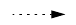
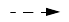
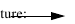
