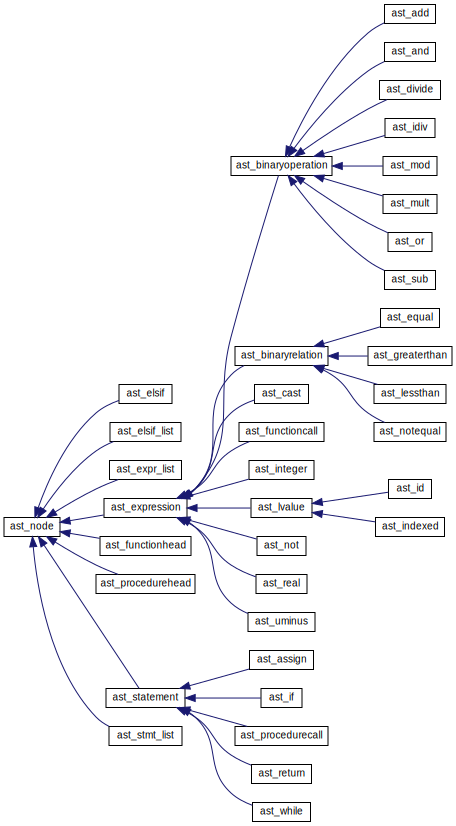

Lab 3: Attribute-Directed Translation
=====================================

.. default-domain:: cpp

The aim of this lab is to generate an internal form of the program. Our
compiler will use *abstract syntax trees*. You will become familiar with
the parser-generating program called `bison <_static/bison/index.html>`_, and will also need to
understand the basic theory behind LR parsing.

Attribute-directed translation
------------------------------

To be able to perform semantic analysis, optimization, generate
intermediary code, and so on; we must transform the program to an
internal form which is convenient to work with. More specifically, we
require an internal form which:

-  is not profiled for a certain machine.

-  is easy to traverse, e.g. provide a basis for interpretation.

-  is easy to optimize.

In this lab *abstract syntax trees* (or AST, for short) will be used as
an internal form. In a subsequent lab we will generate quadruples by
traversing the trees.

The translation to internal form is normally performed by using
so-called syntax-directed translation where each production
:math:`A \rightarrow \alpha` in the grammar is associated with a
*semantic action* – some code which is called when reducing
:math:`A \rightarrow \alpha` (LR parser). For example, the semantic
action could be to:

-  fill in the symbol table upon finding a declaration,

-  perform semantic analysis (see the next section), and/or

-  generate an internal form (everything from abstract syntax trees to
   machine code).

In an *attribute-directed translation* each grammatical symbol has one
or more attributes. The attributes can be extra fields in the parse
tree’s nodes. An attribute can be *inherited* (values are transported
downwards in the parse tree) or synthesised (values are transported
upwards in the parse tree).

It is the semantic actions that ensure that attributes are inherited or
synthesised.

Syntax-directed translation for a simple calculator
~~~~~~~~~~~~~~~~~~~~~~~~~~~~~~~~~~~~~~~~~~~~~~~~~~~

This is an example from the course textbook.
Each non-terminal (E, T, F) has a synthesised
attribute of integer type, val, which is propagated upwards in the parse
tree. The terminal **digit** has a synthesised attribute, *lexval*,
whose value is provided by the scanner.

+-----------+-------------------------------------------+---------------------------+
| *No.*     | *PRODUCTION*                              | *SEMANTIC RULE*           |
+===========+===========================================+===========================+
|       0   | :math:`L \rightarrow E\textrm{ }\vdash`   | ``print(E.val)``          |
+-----------+-------------------------------------------+---------------------------+
|       1   | :math:`E \rightarrow E1 + T`              | ``E.val:=E1 + T.val``     |
+-----------+-------------------------------------------+---------------------------+
|       2   | :math:`E \rightarrow T`                   | ``E.val:=T.val``          |
+-----------+-------------------------------------------+---------------------------+
|       3   | :math:`T \rightarrow T1 * F`              | ``T.val:=T1.val * F.val`` |
+-----------+-------------------------------------------+---------------------------+
|       4   | :math:`T \rightarrow F`                   | ``T.val:=F.val``          |
+-----------+-------------------------------------------+---------------------------+
|       5   | :math:`F \rightarrow (E)`                 | ``F.val:=E.val``          |
+-----------+-------------------------------------------+---------------------------+
|       6   | :math:`F \rightarrow \textrm{digit}`      | ``F.val:= digit.lexval``  |
+-----------+-------------------------------------------+---------------------------+

:math:`\vdash` represents ``<end of line>`` here (usually ``<end of input>``).

Draw a parse tree which shows derivations for the expression
``10+5*2`` and illustrate how the attribute ``val`` is synthesized
upwards. (This is an optional exercise that helps get an understanding
of how syntax-directed translation works.)

LR parsers and parser generators
~~~~~~~~~~~~~~~~~~~~~~~~~~~~~~~~

Much as with scanners, in the old days people wrote parsers by hand.
Again, as the size and complexity of languages grew, the need for
automated tools became evident. There are now exist numerous parser
generator programs, and in this course we will be using one of them,
called ``bison`` (a GNU version of the unix program ``yacc``, which
stands for *Yet Another Compiler Compiler*). Thus, you will not need to
implement your own LR parser. However, make sure you understand the
theory behind how they work! The lectures, as well as the course book,
cover the theory quite well; thus only a few key concepts will be
reiterated here.

An LR parser has a current state, an action table and a goto table.
Depending on the token input from the scanner and the current state, the
parser finds out what to do next: shift a new token, reduce a
production, generate an error message or accept the program as correct.
Semantic actions are performed when a production is reduced.

bison
~~~~~

``bison`` keeps track of all these things for you, however. Your job
will be to implement the semantic actions for most of the productions
that make up DIESEL’s grammar. This is done by editing the ``bison``
input file ``parser.y``.

``bison`` is a very capable program, and it is not feasible to include a
complete description of it here. An exhaustive manual can be found on
the course home page, both in html and postscript format. You will have
to refer to this documentation extensively during this lab, so browsing
it right away to get a basic idea of how bison works and what it can do
is probably a good idea.

Abstract syntax trees
---------------------

The internal form we shall study and use in the lab is known as abstract
syntax trees (from now on called ASTs) and can be said to correspond to
a reduced variant of a parse tree.

Example: The syntax tree for

::

  procedure goofy;
    var x : integer;
  begin
    while (x > 0) do
      x := x - 1;
    end;
  end;

.. digraph :: lab3_while_ast
  :align: center

  node [fontname="Courier New"];
  WHILE -> ">";
  ">" -> X1;
  ">" -> 0;
  WHILE -> ":=";
  ":=" -> X2;
  ":=" -> "-";
  "-" -> X3;
  "-" -> 1;
  X1 [label="X"];
  X2 [label="X"];
  X3 [label="X"];

ASTs can be represented using pointer structures or array references
(see textbook, figure 8.4, p. 465).

In the lab we will generate an AST for each procedure or function body
using a pointer structure. Parsing a block is thus carried out as
follows (this distinction is an important one to make):

Declarations
   When we parse declarations, we install information in the symbol
   table.

Statements
   When we parse statements, we construct an AST using the information
   we just installed in the symbol table.

How do we construct the AST? Well. The AST is made up of *nodes*, and
every node is an instance of an *abstract syntax* class. A leaf node
symbolizes operands (identifiers, digits etc.), while inner nodes
symbolize operators, control structures, statements, etc. When we want
to create a new node during reduction of a production, we simply pass
the significant right-hand nodes as arguments to the left-hand side’s
constructor. The left-hand node will then have the right-hand nodes as
children. By repeating this procedure until an entire block is reduced,
we will then have an AST representing that block’s body (if this was
confusing, taking a look at the constructors for the various ``ast_``
classes in the files ``ast.hh`` and ``ast.cc`` might give additional
insight). Since we only parse one block at a time, declarations and the
like will (almost) never need to be represented in the actual AST. If we
had decided to build an AST representing the entire program, they would
have had to, though. What are the advantages and disadvantages of our
approach?

.. table:: Example of a syntax-directed translation schema for constructing ASTs.

   +-------+------------------------------------+--------------------------------+
   | *No.* | *PRODUCTION*                       | *SEMANTIC RULE*                |
   +=======+====================================+================================+
   | ``0`` | :math:`E \rightarrow E1 + T`       | ``$$ = new ast_add(E1, T);``   |
   +-------+------------------------------------+--------------------------------+
   | ``1`` | :math:`E \rightarrow E1 - T`       | ``$$ = new ast_sub(E1, T);``   |
   +-------+------------------------------------+--------------------------------+
   | ``2`` | :math:`E \rightarrow T`            | ``$$ = $1;``                   |
   +-------+------------------------------------+--------------------------------+
   | ``3`` | :math:`T \rightarrow (E)`          | ``$$ = $2;``                   |
   +-------+------------------------------------+--------------------------------+
   | ``4`` | :math:`T \rightarrow \textrm{num}` | ``$$ = new ast_integer(num);`` |
   +-------+------------------------------------+--------------------------------+

``$$`` is a ``bison`` construct, which in effect is a pointer to the
left-hand side of the production. It can be interpreted as the result
the production returns upwards in the AST (remember we are doing
bottom-up parsing here). As in our example, if we parse ``E1 + T``,
where ``E1`` and ``T`` are ASTs, after reducing this statement our AST
will now be ``E``, which has an addition node as root node and ``E1``
and ``T`` as children nodes.

The :class:`ast_add`, :class:`ast_sub`, and :class:`ast_integer` constructors take the
appropriate ASTs as arguments and build a new AST with the arguments as
children.

Note that the non-terminal operands are, of course, also pointers to
ASTs. The terminal operands can be any one of the data types the scanner
enters into the :var:`yylval` union. Refer to the :ref:`third_party_doc` for more information.

Abstract syntax classes
-----------------------

So far we have discussed ASTs, having a general idea of what the ones we
will be using look like, and we also know that they are built using
pointers. Every node is represented by an object encapsulating the
relevant data for that node type, and every node type corresponds to a
class; an *abstract syntax* class. You will need to understand how these
classes relate to one another, their inheritance structure and so on, in
order to complete this lab successfully. The files ``ast.hh`` and
``ast.cc`` contain the declarations and implementations of these
classes, and you should not need to modify them, although you will have
to study them carefully, and use them.

Before we start listing all the classes, there are a few key points to
make about the way we construct our ASTs using these classes. There are
no explicit methods for building tree nodes anywhere. Instead, we use a
more object-oriented approach, where we simply pass child tree pointers
to the constructor for a new root node. No method calls are involved at
this stage; that will come later, when we perform type checking,
optimization, quad generation and code generation.

Position information
~~~~~~~~~~~~~~~~~~~~

Since our compiler traverses the AST several times during compilation,
it is a *multi-pass* compiler. This means that we cannot depend on the
current position of the lexical token, read like a one-pass compiler
can, for generating useful error messages during compiling. Thus, we
will implement the keeping of position information in the AST nodes,
which will allow us to include the source code position in any error
message no matter during what phase the error is discovered.

Position information is encapsulated using the class
:class:`position_information`, which is declared in the file ``error.hh``. It
currently only holds information about the line and column of an object,
but it would not be too difficult to imagine extending it later on with
other information (lexical context, for example). Every node in the AST
represents some part of the program, and if we discover errors in later
phases when we traverse the tree, we can use the position information
stored in each node to generate appropriate error messages. Therefore,
*all* the abstract syntax classes take a pointer to a
:class:`position_information` object as their first argument.

Inheritance structure
~~~~~~~~~~~~~~~~~~~~~

All the abstract syntax classes inherit from a common superclass called
:class:`ast_node`. From this class are derived statements, expressions, and
other classes, most of which in turn are further subclassed to form the
classes that actually appear in the AST. Thus the classes can be divided
into *abstract* superclasses, and *concrete* subclasses (in our case,
all classes with a subclass are abstract classes). Only the concrete
classes will ever be instantiated. The inheritance structure looks as
follows (see also the ascii diagram in the comment at the top of the
file ``ast.hh``):

Class descriptions
~~~~~~~~~~~~~~~~~~

Here, a brief description of each abstract syntax class will be given.
This part will make a lot more sense if you study a copy of the file
``ast.hh`` as you read it.

Abstract classes
^^^^^^^^^^^^^^^^

.. doxygenclass :: ast_node
  :members: pos, tag
  :no-link:

.. doxygenclass :: ast_statement
  :no-link:

.. doxygenclass :: ast_expression
  :members: type
  :no-link:

.. doxygenclass :: ast_lvalue
  :no-link:

.. doxygenclass :: ast_binaryrelation
  :members: left, right
  :no-link:

.. doxygenclass :: ast_binaryoperation
  :members: left, right
  :no-link:

Concrete classes
^^^^^^^^^^^^^^^^

.. doxygenclass :: ast_elsif
  :members: condition, body
  :no-link:

.. doxygenclass :: ast_expr_list
  :members: last_expr, preceding
  :no-link:

.. doxygenclass :: ast_stmt_list
  :members: last_stmt, preceding
  :no-link:

.. doxygenclass :: ast_elsif_list
  :members: last_elsif, preceding
  :no-link:

.. doxygenclass :: ast_procedurehead
  :members: sym_p
  :no-link:

.. doxygenclass :: ast_functionhead
  :members: sym_p
  :no-link:

.. doxygenclass :: ast_procedurecall
  :members: id, parameter_list
  :no-link:

.. doxygenclass :: ast_functioncall
  :members: id, parameter_list
  :no-link:

.. doxygenclass :: ast_assign
  :members: lhs, rhs
  :no-link:

.. doxygenclass :: ast_while
  :members: condition, body
  :no-link:

.. doxygenclass :: ast_if
  :members: condition, body, elsif_list, else_body
  :no-link:

.. doxygenclass :: ast_return
  :members: value
  :no-link:

.. doxygenclass :: ast_uminus
  :members: expr
  :no-link:

.. doxygenclass :: ast_not
  :members: expr
  :no-link:

.. doxygenclass :: ast_integer
  :members: value
  :no-link:

.. doxygenclass :: ast_real
  :members: value
  :no-link:

.. doxygenclass :: ast_cast
  :members: expr
  :no-link:

.. doxygenclass :: ast_equal
  :no-link:

.. doxygenclass :: ast_notequal
  :no-link:

.. doxygenclass :: ast_lessthan
  :no-link:

.. doxygenclass :: ast_greaterthan
  :no-link:

.. doxygenclass :: ast_add
  :no-link:

.. doxygenclass :: ast_sub
  :no-link:

.. doxygenclass :: ast_or
  :no-link:

.. doxygenclass :: ast_and
  :no-link:

.. doxygenclass :: ast_mult
  :no-link:

.. doxygenclass :: ast_divide
  :no-link:

.. doxygenclass :: ast_idiv
  :no-link:

.. doxygenclass :: ast_mod
  :no-link:

.. doxygenclass :: ast_id
  :members: sym_p
  :no-link:

.. doxygenclass :: ast_indexed
  :members: id, index
  :no-link:

Implementation
--------------

Your job is to complete the file ``parser.y``, adding semantic actions
for all the productions not already written. (Look for “Your code here”
comments.). In these actions, you should either update the symbol table
or construct the abstract syntax tree, as appropriate (note that you
should *not* bother with type checking! That is the subject of the next
lab). Have the ``bison`` manual handy while you do this lab! Also, make
sure you take a good look at what is already written before you start
coding yourself. You will have to become familiar with the abstract
syntax classes in detail in this lab. The comments in the files
``ast.hh`` and ``ast.cc`` are your friends.

Doing all this is going to take some time, and some thinking. Once you
understand the concept, you should be doing ok. Be prepared to put in
some effort, however.

.. epigraph::

  Easy victories waste too much time in celebration.

  -- DANA S. SCOTT

Sit down, think about what there is to put together. Am I dealing with a
declaration or a statement? What will the tree look like when I have
finished? What attributes are there in the abstract symbol classes? What
kinds of parameters do I need to send to which constructor? In which
production shall I call :func:`~symbol_table::open_scope()`? And before you start editing
make sure you read  and .

The files you need to change
~~~~~~~~~~~~~~~~~~~~~~~~~~~~

parser.y
   is the input file to ``bison``. This is the only file you will do
   most of editing in.

Other files of interest
~~~~~~~~~~~~~~~~~~~~~~~

error.h, error.cc, symtab.hh, symbol.cc, and symtab.cc
   Use your completed versions from the earlier labs.

ast.hh
   contains the definitions for the AST nodes. You’ll be reading this
   file a lot.

ast.cc
   contains the implementations of the AST nodes. It also contains the
   printing code which is rather messy, but if you have a hard time
   understanding the AST printouts maybe it’ll help taking a look at it.
   Note that the implementation of AST nodes is split up into several
   ``.cc`` files, one for the methods concerning AST construction, one
   for type checking, one for optimizing, one for quads, and one for
   code generation. What are the advantages of this organisation?

semantic.hh and semantic.cc
   contain type-checking code. You won’t need to
   edit these files until the next lab.

optimize.hh and optimize.cc
   contain optimization code. You won’t need to
   edit these files until two labs later.

quads.hh and quads.cc
   contain quad generation code. You won’t need to
   edit these files until three labs later.

codegen.hh and codegen.cc
   contain assembler generation code. You won’t need
   to edit these files until the last lab.

main.cc
   this is the compiler wrapper, parsing flags and the like.

Makefile
   this is *not* the same as the last labs. It generates a file called
   ``compiler`` which will take various arguments (see ``main.cc`` for
   information). It also takes source files as arguments, so you can
   start using diesel files to test your compiler-in-the-making.

diesel
   this is a shell script which works as a wrapper around the binary
   compiler file, handling flags, linking, and such things. Use it when
   you want to compile a DIESEL file. At the top of this file is a list
   of all flags you can send to the compiler, for debugging, printouts,
   symbolic compilation and the like. Very useful!

.. _sec:3decl:

Declarations and routines available in *ast.hh*, *ast.cc*, *symtab.hh* and *symtab.cc*
~~~~~~~~~~~~~~~~~~~~~~~~~~~~~~~~~~~~~~~~~~~~~~~~~~~~~~~~~~~~~~~~~~~~~~~~~~~~~~~~~~~~~~

The AST classes have already been covered in detail above. Refer to the
``ast.hh`` file for their declarations. Note that you do not construct
the AST by calling any methods, but only by passing arguments to node
constructors. The :type:`ast_node_type` type contains a list of all valid
AST tags, used for identifying node class when safe downcasting is
needed (you used this technique when you wrote the :func:`~symbol_table::enter_procedure()`
method of the symbol table, for example).

.. _sec:3spec:

Program specification
~~~~~~~~~~~~~~~~~~~~~

#. Remember *not* to bother with type checking at this point! That will
   be done in the next lab.

#. You are *not* allowed to perform any semantic actions at any other
   time than when a production is reduced. ``bison`` allows it at other
   times as well, but it’s rarely a good idea to do it. Why not?

#. The way the DIESEL grammar is currently written, the compiler will
   bail out as soon as it discovers a parse error. That is not a
   desirable behaviour: We want compilation to go on as long as
   possible, so multiple errors can be discovered in the same run. In at
   least four places in the code (``const_decl``, ``opt_param_list``,
   ``stmt``, ``rvariable``) it would be strategic to catch errors.
   There’re at least five more places in the code where it would be
   appropriate to have error productions, but you don’t need to find
   them. Read in the ``bison`` manual about *error productions*, and
   look at the error productions that are already implemented, before
   you start with this task.

Debugging help
~~~~~~~~~~~~~~

All AST classes can be sent directly to ``cout``, and they will print
all their children as well in an ascii format. Note that since the
various AST list classes store their last statement, expression, or elsif
clause and their preceding children like they do, a ``NULL`` node will
appear, representing an empty preceding list, here and there in the
tree. This is as it should be. It shouldn't take long to figure the
format out.

How do I know it’s correct?
~~~~~~~~~~~~~~~~~~~~~~~~~~~

For test purposes all files with the suffix .d can be used. Study the
symbol table and the AST printout afterwards. You should be able to
figure out what they are supposed to look like, and compare with what
your program thinks they should look like. Two examples are attached as
an enclosure, and you can also look at the examples in the theory part
above for reference. Also test your error productions by trying to parse
some files which contain parse errors (you can easily construct them
yourself by fiddling with the correct DIESEL source code files).

Reporting your work
-------------------

* For the demonstration, run the test program
  for the three test cases ``parstest1.d``-``parstest3.d`` and discuss your code.
* Hand in your code as described in :ref:`handing-in-results`.

Example execution
-----------------

Running ``make lab3`` will take the sample input and compare it to the
sample output. You should test your code on more examples than this.

.. code-block:: bash

  ./diesel -a -b -c -f -p ../testpgm/parstest1.d

.. literalinclude:: ../../code/trace/parstest1.trace
  :language: none
  :caption: trace/parstest1.trace

.. code-block:: bash

  ./diesel -a -b -c -f -p ../testpgm/parstest2.d

.. literalinclude:: ../../code/trace/parstest2.trace
  :language: none
  :caption: trace/parstest2.trace

.. code-block:: bash

  ./diesel -a -b -c -f -p ../testpgm/parstest3.d

.. literalinclude:: ../../code/trace/parstest3.trace
  :language: none
  :caption: trace/parstest3.trace
