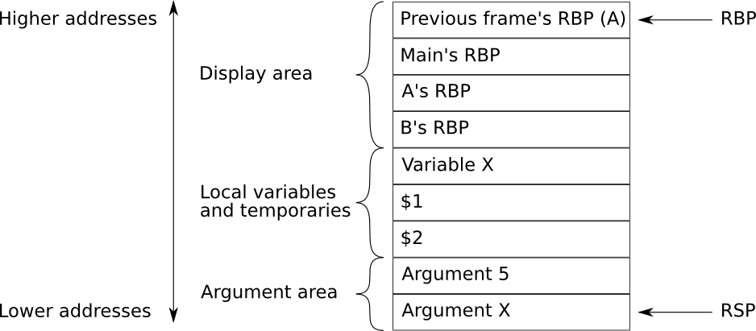
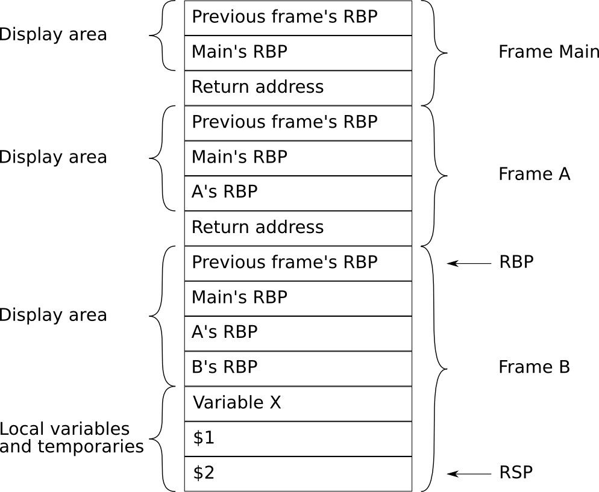
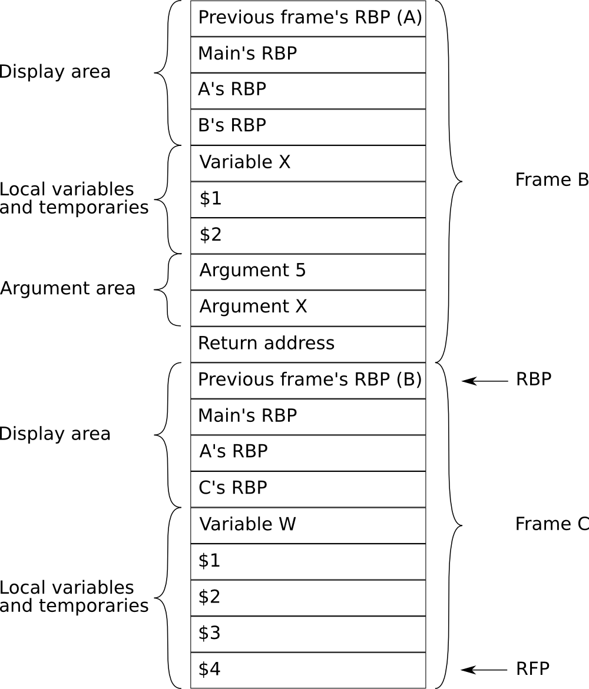

Lab 7: Memory Management and Intel Assembler
============================================

In this final lab we will study memory management and assembler code
generation for the Intel processor.

Memory management
-----------------

By memory management we mean the administration of the objects which are defined and used in the program.
In certain programming languages recursion is forbidden and the size of all data must be known at compilation time (e.g. FORTRAN 77).
For these all data can be referenced using absolute addresses and no so-called runtime support is needed.
This is called static memory management, and generates fast code at the expense of flexibility and convenience.
More sophisticated languages use recursion and dynamic structures (e.g. Pascal, C++, Java).
Static allocation is not possible as, for example, the name of a local variable may correspond to several memory cells (during recursion).
Dynamic memory management is used for these languages.
All data belonging to a block (procedure or function) is gathered into an *activation record* (AR, also stack frame).
The activation record is created first when the block is called and allocated to a stack.
Memory space is released when you leave the block. Example:

::

   procedure fum(i : integer);
   begin
      if i <> 0 then
         fum(i - 1);
      end;
   end;
   procedure fie;
   begin
      fum(1);
   end;
   procedure foo;
   begin
      fie();
   end;

.. graphviz ::
  :caption: The sequence in the diagram illustrates how the activation records are allocated to and released from the stack.

  digraph diesel_11_activation_ex1 {
    node [shape=record, fontname="Courier New"];
    rankdir=LR;

    subgraph {
      rankdir=TB;
      struct1 [label="<b> foo|"];
      struct2 [label="fie|<b> foo|"];
      struct3 [label="fum|fie|<b> foo|"];
      struct4 [label="fum|fum|fie|<b> foo|"];
      struct5 [label="fum|fie|<b> foo|"];
      struct6 [label="fie|<b> foo|"];
      struct7 [label="<b> foo|"];
    }
    struct1:b -> struct2:b [ style = invis, weight = 10 ];
    struct2:b -> struct3:b [ style = invis, weight = 10 ];
    struct3:b -> struct4:b [ style = invis, weight = 10 ];
    struct4:b -> struct5:b [ style = invis, weight = 10 ];
    struct5:b -> struct6:b [ style = invis, weight = 10 ];
    struct6:b -> struct7:b [ style = invis, weight = 10 ];
  }

An activation record can contain the following (depending on the
language):

* Local data
* Temporary data
* Return address
* Parameters
* Pointers to the previous activation record (dynamic link).
* Static link or display to find the right reference to non-local variables.
* Dynamically allocated data (dope-vectors).
* Possibly space for return values (applies to functions, not procedures).
* Place to save register contents.

A certain register in the machine is always assumed to point to the
last-created activation record. The *dynamic* link points to the
activation record for calling blocks. The dynamic link thus returns the
call chain.

To find non-local names we have to supply a mechanism which returns the
program’s textual environment. There are two ways of doing this:

Static link (also *access link*)
   A special field in the activation record is reserved for the static link.
   It points to the activation record which represents the surrounding block in the program.

   Note that the static link and dynamic link are not the same if there is a recursive call chain, for example:

   ::

      program main;

      procedure p1;
         procedure p2;
            procedure p3;
            begin
               p1(); { (1) }
            end;
         begin
            p3();
         end;
      begin
         p2();
      end;

      begin
         p1();
      end.

   .. figure:: pics/diesel_11_activation_ex2.png
      :alt: This is how the stack will look after *(1)* (the second call by p1, in the example code, above.)

      This is how the stack will look after *(1)* (the second call by ``p1``,
      in the example code, above.)

   If a variable in block ``x`` is referenced in block ``y``, you must
   follow ``ny-nx`` links where ``nx`` and ``ny`` are the lexical levels
   (nesting depth) for blocks ``x`` and ``y``, respectively. The link is
   set up by the calling block during execution. It is easy to see that
   deeply nested blocks can lead to long search times.

Display
   A *display* is a table with addresses to surrounding procedures.
   The table can be kept in a number of dedicated registers or stored
   in the activation records. Example:

   ::

      program main;

      procedure p2;
         procedure p3;
         begin
            { (2) }
         end;
      begin
         p3();
      end;

      procedure p1;
      begin
         p2();
         { (1) }
      end;

      begin
         p1();
      end.

   .. figure:: pics/diesel_11_activation_ex3a.png
      :alt: The stack, at *(1)*.

      The stack, at *(1)*.

   .. figure:: pics/diesel_11_activation_ex3b.png
      :alt: The stack, at *(2)*.

      The stack, at *(2)*.

   When a block is called we have to update the display element which
   corresponds to the block’s lexical level. When you later leave the
   block, the value must be restored; this is why it is appropriate to
   save the old value in, for example, the activation record. A variable
   in block ``x`` can be found in the activation record which is pointed
   to by display element ``nx``, where ``nx`` is the block’s lexical
   level.

   In the figures above, the global variables are also placed on the
   stack. As the global level is always available, the global variables
   can be stored in absolute addresses [1]_. This has a major advantage.
   Assume that we reference a global variable in the program. If we use
   the static link method, the whole chain must be followed down to the
   global activation record. By placing global variables in absolute
   addresses we can treat them as a special case at code generation and
   reach them “directly”.

   Displays were originally introduced by E.W. Dijkstra :cite:`1961:Dijkstra` in order to avoid the long search times a static link leads to when referencing in deeply nested blocks.
   Experiments in Lund with Simula-compilers have, however, demonstrated that the static link method is actually faster :cite:`1982:Löfgren`.
   How can this be so?
   Examination of program texts have shown that 98% of all variable references are either local or global.
   That is, if static link is used, in 98% of the cases you need not follow it!
   The variable is either in the current activation record or in an absolute address.
   “The running costs” for the unusual cases (2% of the references) are obviously lower than the work required in maintaining the display.

Code generation for Intel
-------------------------

We are going to use a simple method which expands each quadruple to one
or more assembler instructions. While the Intel processor supports a
wealth of instructions we will limit ourself to the basic ones. The aim
is not to generate good code (that would be too time-consuming), but
rather to quickly get the compiler up and running.

If you would like to read Intel's official reference to Intel assembly, see
`Volume A <http://www.intel.com/content/dam/www/public/us/en/documents/manuals/64-ia-32-architectures-software-developer-vol-2a-manual.pdf>`_ and
`Volume B <http://www.intel.com/content/dam/www/public/us/en/documents/manuals/64-ia-32-architectures-software-developer-vol-2b-manual.pdf>`_ for 1358 pages and counting.
Since it is hard to hyperlink directly into that PDF, these instructions links to a simpler `HTML version <_static/x86doc/ADD.html>`_ instead.

Registers
~~~~~~~~~

The Intel processor has a number of general purpose registers that can
be used to store temporary data. Some of these registers also service a
special purpose such as keeping track of the stack, base and instruction
pointers. :ref:`The table below <tab:regs>` shows the registers we will
be using in the lab and their purposes. Note that some of these
registers also serve a special purpose, but as we don’t use them as such
we will ignore that.

.. table:: Some of the Intel registers and their usage.
   :name: tab:regs

   +------------+------------------------------------------------------+
   | Register   | Usage                                                |
   +============+======================================================+
   |   RAX      | Temporary data and return the value from a function. |
   +------------+------------------------------------------------------+
   |   RCX      | Temporary data.                                      |
   +------------+------------------------------------------------------+
   |   RDX      | The modulus from a division.                         |
   +------------+------------------------------------------------------+
   |   RSP      | The stack pointer.                                   |
   +------------+------------------------------------------------------+
   |   RBP      | The base pointer.                                    |
   +------------+------------------------------------------------------+
   |   RFLAGS   | Status and control register.                         |
   +------------+------------------------------------------------------+

In the processor’s status register there are, amongst other things, the
flags described below:

.. table:: Five flags in the Intel status register.
   :name: tab-flags

   +-----------------------+-----------------------+-----------------------+
   | Flag                  | Name                  | Meaning               |
   +=======================+=======================+=======================+
   |   CF                  | Carry flag            | Carry flag from       |
   |                       |                       | arithmetic operations |
   +-----------------------+-----------------------+-----------------------+
   |   OF                  | Overflow flag         | Signals arithmetic    |
   |                       |                       | overflow              |
   +-----------------------+-----------------------+-----------------------+
   |   ZF                  | Zero flag             | Is set to ``1``       |
   |                       |                       | if the result is zero |
   +-----------------------+-----------------------+-----------------------+
   |   SF                  | Sign flag             | Is set to ``0``       |
   |                       |                       | if positive,          |
   |                       |                       | ``1`` if the          |
   |                       |                       | result is negative    |
   +-----------------------+-----------------------+-----------------------+
   |   PF                  | Parity flag           | Is set to ``1``       |
   |                       |                       | if the                |
   |                       |                       | least-significant     |
   |                       |                       | byte of the result    |
   |                       |                       | contains an even      |
   |                       |                       | number of 1 bits      |
   +-----------------------+-----------------------+-----------------------+

These flags are mainly used to control conditional jumps:

.. code-block :: nasm

       cmp      rax, rcx       ; rax-rcx
       jne      label          ; jne = Jump if Not Equal

In the example the two registers are compared and the flags in the
status register are set in accordance with the result of the comparison
(actually the value of ``rax``-``rcx``). The jump is made if the condition
NE (Not Equal) applies.

In total there are over 50 different jump conditions, but we
will only use a subset of them in this lab.

Arithmetic Operations
~~~~~~~~~~~~~~~~~~~~~

The general format for an arithmetic operation is:

.. code-block :: nasm

       op       dest, src

where ``src`` is either a general register or a memory location, or a
constant integer in two-complement format.

Available instructions include addition, subtraction, multiplication,
division, shift and bitwise operations:
`ADD <_static/x86doc/ADD.html>`_,
`SUB <_static/x86doc/SUB.html>`_,
`IMUL <_static/x86doc/IMUL.html>`_,
`IDIV <_static/x86doc/IDIV.html>`_,
`SAL <_static/x86doc/SAL.html>`_,
`AND <_static/x86doc/AND.html>`_,
`OR <_static/x86doc/OR.html>`_,
`XOR <_static/x86doc/XOR.html>`_.

Floating Point Unit
~~~~~~~~~~~~~~~~~~~

For the floating point operations we will use the Intel x87 Floating Point Unit (*FPU*).
The FPU is a limited stack (implemented using 8 registers) where the values are pushed and operated on.
The values can only be pushed from memory and popped back into memory.
The top of the stack is denoted by ``ST(0)``, or simply ``ST``, and the following elements by ``ST(1)``, ``ST(2)`` and so on.

The FPU instructions are different from the rest of the Intel instructions and are generally prefixed by ``f``.
Some instructions are also suffixed by ``p`` to make them pop an element from the stack.

.. code-block :: nasm

       fld       arg1  ; Push arg1 on the stack
       fld       arg2  ; Push arg2 on the stack
       faddp           ; Add the first two stack elements together. Store the
                       ; result in ST(1) and pop the stack.
       fstp      res   ; Pop the top value of the stack into memory

.. note ::

  If you would like to, you can use SSE2 instructions such as
  `ADDSD <_static/x86doc/ADDSD.html>`_,
  instead of the x87 `FADDP <_static/x86doc/FADDP.html>`_:

  .. code-block :: nasm

       movsd     xmm1, arg1 ; Load memory location arg1 to register xmm1
       addsd     xmm1, arg2 ; Add memory location arg2 to register xmm1
       movsd     xmm1, res  ; Store xmm1 at memory location res

  In case you use SSE2, these lab instructions do very little to help you, and the skeleton source code may need to be adapted, but the CPU instructions themselves may be easier to use (there is no stack machine involved).

  Note that the above code is untested; contributions to the lab skeleton and these instructions would be accepted to give a choice in FPU implementation.

Memory access
~~~~~~~~~~~~~

.. code-block :: nasm

       mov       dest, src

`MOV <_static/x86doc/MOV.html>`_ (*move*) copies data from the given source and places it in the destination specified.
The instruction can move constants directly into registers or memory locations.

.. table:: Supported combinations by MOV.

   +------------+------------------+
   | Destinaton | Source           |
   +============+==================+
   | Register   | Register         |
   +------------+------------------+
   | Memory     | Register         |
   +------------+------------------+
   | Register   | Memory           |
   +------------+------------------+
   | Register   | Constant integer |
   +------------+------------------+
   | Memory     | Constant integer |
   +------------+------------------+

Note that moving data from memory location to memory location is not supported.
To move data from or to memory addresses ``MOV`` requires the usage of the following syntax (``[x]`` is the zeroth index of ``x``; simple dereferencing).

.. code-block :: nasm

       mov        dest,   [src] ; dest = src[0]
       mov       [dest+0], src  ; dest[0] = src
       mov       [dest],   src  ; dest[0] = src
       mov        dest,    src  ; dest = src

This address syntax is supported by most instructions but for some of them ``qword ptr`` (*quad word pointer*, 8 bytes) must be added so the assembler knows the size of the data.
Often there’s no need to specify the size of the data as the assembler can figure it out based on the source or destination registry.
Instructions that do need to know the size include the floating point instructions as there is no register included with the operation.
In this lab the size will always be a ``qword``, but ``word`` (2 bytes) and ``dword`` (*double word*, 4 bytes) are some of the other sizes.

.. code-block :: nasm

       fld       qword ptr [src]
       fistp     qword ptr [dest]

.. _sec:activformat:

Format of activation records
~~~~~~~~~~~~~~~~~~~~~~~~~~~~

   Format of the activation record before a CALL instruction. In this
   example the current frame is B.

The stack for the activation records grows towards lower addresses. The
stack pointer ``RSP`` always points to the top of the stack. The frame
pointer ``RBP`` always points to the last activation record that was
pushed onto the stack. The uppermost activation record on the stack
belongs to the subroutine which is currently executing.
Pushing another activation record onto the stack for example by calling another subroutine from the
current one, causes the old ``RSP`` to become the new ``RBP``, and ``RSP`` will be decreased by the size of the new frame.

The only fixed information in a frame is the previous ``RBP`` and the return address from a ``CALL`` instruction.
The previous ``RBP`` is always available at the current ``RBP`` while the return address is at
the bottom of the frame.
All other areas are of a dynamic size, including ``0`` (non-existing).
It’s not shown in :numref:`fig:7activrec`, but the return address to
the previous frame is stored in the previous frame.

Local and temporary variables are addressed with a negative offset from ``RBP``.
Parameters are stored at the end of the previous frame and therefore addressed with positive offset from ``RBP`` (for details, see :ref:`sec:activrec`).

Parameter transfer
~~~~~~~~~~~~~~~~~~

Experience from previous years has shown that parameter transfer is
often a source of confusion. Read this section carefully! It contains
more information than might be apparent at a glance. Consider the
following expression:

::

            f(g(a, b), c)

which should generate the following quadruples:

.. code-block :: nasm

            ; (evaluate c to $1)
            q_param $1                 ; arg #2 to f
            ; (evaluate b to $2)
            q_param $2                 ; arg #2 to g
            ; (evaluate a to $3)
            q_param $3                 ; arg #1 to g
            q_call g, 2 argument, value in $4
                                       ; implicit pop off argument stack
            q_param $4                 ; arg #1 to f
            q_call f, 2 argument, value in $5
                                       ; implicit pop off argument stack

This is simple to implement on a conventional stack machine such as the
Intel processor.

Translation schema for quadruples
---------------------------------

There now follows a translation schema for quadruples to Intel assembler
code:

.. note ::

  :func:`~code_generator::fetch`, :func:`~code_generator::fetch_float`, :func:`~code_generator::store`, :func:`~code_generator::store_float`, :func:`~code_generator::array_address` and :func:`~code_generator::frame_address` are not assembly code: they denote procedure calls which are to be made to generate the intended code; see the assignments at the end of the chapter.

.. note ::

  Quads that have the same input and output structure are grouped together in the same definition.
  See the comments after each line to see which quad it belongs to.

.. highlight:: nasm

``(q_iload | q_rload, arg1, -, res)``
  ::

    mov            rax, arg1
    store          rax, res

``(q_iassign | q_rassign, arg1, -, res)``
  ::

    fetch          arg1, rax
    store          rax, res

``(q_istore | q_rstore, arg1, -, res)``
  ::

    fetch          arg1, rax
    fetch          res, rcx
    mov            [rcx], rax

``(q_inot, arg1, -, res)``
  ::

    fetch          arg1, rax
    cmp            rax, 0
    je             L1
    mov            rax, 0
    jmp            L2
    L1:
    mov            rax, 1
    L2:
    store          rax, res

``(q_iuminus, arg1, -, res)``
  ::

    fetch          arg1, rax
    neg            rax
    store          rax, res

``(q_ruminus, arg1, -, res)``
  ::

    fetch_float    arg1
    fchs
    store_float    res

``(q_iplus | q_iminus | q_imult | q_idivide | q_imod, arg1, arg2, res)``
  ::

    fetch          arg1, rax
    fetch          arg2, rcx

    add            rax, rcx ; q_iplus

    sub            rax, rcx ; q_iminus

    imult          rax, rcx ; q_imult

    cqo            rax, rcx ; q_idivide, q_imod
    idiv           rax, rcx ; q_idivide, q_imod

    store          rax, res ; All except q_imod
    store          rdx, res ; q_imod

``(q_rplus | q_rminus | q_rmult | q_rdivide, arg1, arg2, res)``
  ::

    fetch_float    arg1
    fetch_float    arg2

    faddp ; q_rplus

    fsubp ; q_rminus

    fmulp ; q_rmult

    fdivp ; q_rdivide

    store_float    res

``(q_ior, arg1, arg2, res)``
  ::

    fetch          arg1, rax
    cmp            rax, 0
    jne            L1
    fetch          arg2, rax
    cmp            rax, 0
    jne            L1
    mov            rax, 0
    jmp            L2
    L1:
    mov            rax, 1
    L2:
    store          rax, res

``(q_iand, arg1, arg2, res)``
  ::

    fetch          arg1, rax
    cmp            rax, 0
    je             L1
    fetch          arg2, rax
    cmp            rax, 0
    je             L1
    mov            rax, 1
    jmp            L2
    L1:
    mov            rax, 0
    L2:
    store          rax, res

``(q_ieq | q_ine | q_ilt | q_igt, arg1, arg2, res)``
  ::

    fetch          arg1, rax
    fetch          arg2, rcx
    cmp            rax, rcx

    je             L1 ; q_ieq

    jne            L1 ; q_ine

    jl             L1 ; q_ilt

    jg             L1 ; q_igt

    mov            rax, 0
    jmp            L2
    L1:
    mov            rax, 1
    L2:
    store          rax, res

``(q_req | q_rne | q_rlt | q_rgt, arg1, arg2, res)``
  ::

    fetch_float    arg1
    fetch_float    arg2
    fcomip         ST(0), ST(1)
    fstp           ST(0)

    je             L1 ; q_req

    jne            L1 ; q_rne

    jb             L1 ; q_rlt

    ja             L1 ; q_rgt

    mov            rax, 0
    jmp            L2
    L1:
    mov            rax, 1
    L2:
    store          rax, res

``(q_itor, arg1, -, res)``
  ::

    frame_address  rcx
    fild  qword ptr [rcx+offset(arg1)]
    store_float    res

``(q_lindex, arg1, arg2, res)``
  ::

    array_address  arg1, rax
    fetch          arg2, rcx
    imul           rcx, 8
    sub            rax, rcx
    store          rax, res

``(q_irindex | q_rrindex, arg1, arg2, res)``
  ::

    array_address  arg1, rax
    fetch          arg2, rcx
    imul           rcx, 8
    sub            rax, rcx
    mov            rax, [rax]
    store          rax, res

``(q_param, arg1, -, -)``
  ::

    ; ...

``(q_call, arg1, arg2, -)``
  ::

    ; ...
    call           arg1
    ; ...

``(q_call, arg1, arg2, res)``
  ::

    ; ...
    call           arg1
    ; ...
    store          rax, res

``(q_labl, arg1, -, -)``
  ::

    Larg1: ; if arg1=1, generate L1:

``(q_jmp, arg1, -, -)``
  ::

    jmp             Larg1

``(q_jmpf, arg1, arg2, -)``
  ::

    fetch          arg2, rax
    cmp            rax, 0
    je             Larg1

``(q_ireturn | q_rreturn, arg1, arg2, -)``
  ::

    fetch          arg1, rax
    jmp            Larg1

``(q_nop, -, -, -)``
  ::

    ; nop

.. highlight:: pascal

Comments
~~~~~~~~

-  Some code has intentionally been left out of this table since you are
   supposed to write it yourself. This concerns the :func:`~code_generator::find`, :func:`~code_generator::fetch`,
   :func:`~code_generator::fetch_float`, :func:`~code_generator::store`, :func:`~code_generator::store_float`, :func:`~code_generator::array_address` and
   :func:`~code_generator::frame_address` methods as well as the two quadruples :enumerator:`q_call`
   and :enumerator:`q_param`.

-  For :enumerator:`q_call`: Code for calling the procedure/function.

-  For :enumerator:`q_param`: Code for preparing ``arg1`` as an argument.

-  | ``offset(somearg)`` should be the integer offset of the argument
     and not literally
   | ``offset(somearg)``.

-  ``fstp ST(0)`` is used to remove the top element of the floating
   point stack. (It actually stores the value of the argument, here
   ``ST(0)``, in ``ST(0)`` and then pops the stack.)

-  `cqo <_static/x86doc/CWD_CDQ_CQO.html>`_ sign-extends the value in ``rax`` to a 128-bit number
   and stores it in ``rdx:rax`` (high bits in ``rdx``, low bits in
   ``rax``). ``rdx:rax`` is the numerator used when executing an
   `idiv <_static/x86doc/IDIV.html>`_ instruction.

.. _sec:activrec:

Activation records
------------------

Intel has two instructions which create and release frames on the stack:
`ENTER <_static/x86doc/ENTER.html>`_ and `LEAVE <_static/x86doc/LEAVE.html>`_.
`ENTER <_static/x86doc/ENTER.html>`_ copies the display area according to the lexical level and allocates space for local variables and temporaries.
`LEAVE <_static/x86doc/LEAVE.html>`_ will free the allocated frame.

Unfortunately the `ENTER <_static/x86doc/ENTER.html>`_ instruction only supports allocation of memory up to a size of 65536 bytes (64 kB).
To allocate more memory for a frame, the frame needs to be allocated manually, which will be done in this lab.

The size of a frame is determined by the number of local and temporary variables in the block and is, as we know, stored for procedure and function symbols in the symbol table under the :member:`~procedure_symbol::ar_size` attribute.

Example 1: Creating and releasing a frame
~~~~~~~~~~~~~~~~~~~~~~~~~~~~~~~~~~~~~~~~~

We have the following code fragment:

::

   program main;

     procedure A;
       procedure C(X : integer; Z : integer);
         var W : integer;
       begin { block b4 }
         W := X * 3 + Z - 2;
       end;

       procedure B;
         var X : integer;
       begin { block b3 }
         X := 1;
         C(X, 5);
       end;
     begin { block b2 }
       B();
     end;

   begin { block b1 }
     A();
   end.

   The stack when in *block b3*

:numref:`fig:7ex1a`: Our example starts in *block b3*.
b1’s and b2’s activation records have both been pushed on the stack. b3
has also been pushed on the stack with its local variables and
temporaries. Note that the size of each display area is ``level + 1``.

   The stack when in *block b4*.

:numref:`fig:7ex1b`: Now when we enter procedure ``C``
the calling block (``B``) starts by placing its parameters on the stack.
After that the control is transfered to ``C`` which pushes ``B``\ ’s
``RBP`` on the stack and copies the display area. Note that ``B``\ ’s
pointer is ignored as it is on the same lexical level as ``C``. Once the
display area has been copied ``C``\ ’s ``RBP`` is pushed on the stack.
Finally the ``RBP`` and ``RSP`` are updated to point to ``C``\ ’s frame.

When leaving the block the frame must be released and the code returning
control to it’s caller. It is done by the following instructions.

.. code-block :: nasm

       leave    ; Deallocate current frame
       ret      ; Return to the caller

After that the caller needs to remove the parameters pushed on the stack
by increasing the ``RSP`` pointer.

Example 2
~~~~~~~~~

Since we represent the entire code block as quadruples before we
translate it into assembler, the required size of the activation record
is known when we start expanding the quads to assembler. Why? See the
example below:

.. code-block :: nasm

   L3:                    ; some procedure
       push    rbp        ; store the previous RBP
       mov     rcx, rsp   ; save the previous RSP in a temporary location
                          ; this is also this frame's RBP
       .
       .                  ; any other display values are copied here
       .
       push    rcx        ; push the previous RSP on the stack
       mov     rbp, rcx   ; and really make it our new RBP
       sub     rsp, 392   ; allocate space for temporary storage
       .
       .                  ; translated quadruples
       .
       leave              ; release activation record
       ret                ; return

Implementation
--------------

In this lab, you will write certain routines that help expanding
quadruples into assembler, as well as some routines for handling
creating and releasing activation records.

This is done by traversing a quad list, expanding each quad to assembler as we go.
The expansion is started from ``parser.y`` with a call to :func:`~code_generator::generate_assembler()`.
The standalone class :class:`code_generator` contains all functionality for generating Intel assembler from the (platform-independent) quad list.
This design ensures that as long as the :class:`code_generator` class implemented in ``codegen.cc`` follows the interface from ``codegen.hh``, it can be exchanged for another class which implements code for some other architecture without need to change any other part of the compiler.

Note that memory management is dynamic (because of recursion) and is implemented using a stack.
Global variables are also stored on the stack.
Referencing non-local variables is performed using displays which are also stored on the stack in each frame.

The files you need to change
~~~~~~~~~~~~~~~~~~~~~~~~~~~~

codegen.hh and codegen.cc
  contain assembler generation code for the Intel assembler.
  These are the files you will edit in this lab.

Other files of interest
~~~~~~~~~~~~~~~~~~~~~~~

parser.y
   is the input file to ``bison``.

ast.hh
   contains the definitions for the AST nodes.

ast.cc
   contains (part of) the implementations of the AST nodes.

error.hh, error.cc, symtab.hh, symbol.cc, symtab.cc, scanner.l, semantic.hh, semantic.cc, optimize.hh, optimize.cc, quads.hh, and quads.cc
     use your versions from the earlier labs.

main.cc
   this is the compiler wrapper, parsing flags and the like. Same as in the previous labs.

Makefile
   and ``diesel`` use the same files as in the last lab.

Available declarations and routines in *codegen.hh*, *codegen.cc*
~~~~~~~~~~~~~~~~~~~~~~~~~~~~~~~~~~~~~~~~~~~~~~~~~~~~~~~~~~~~~~~~~

The following routines have already been written:

.. doxygenclass :: code_generator
  :members: generate_assembler, align
  :no-link:

Program specification
~~~~~~~~~~~~~~~~~~~~~

Complete the following functions:

.. doxygenfunction :: code_generator::prologue

.. doxygenfunction :: code_generator::epilogue

.. doxygenfunction :: code_generator::find

.. doxygenfunction :: code_generator::fetch

.. doxygenfunction :: code_generator::store

.. doxygenfunction :: code_generator::fetch_float

.. doxygenfunction :: code_generator::store_float

.. note ::

   Constants cannot be pushed directly to the floating-point stack, but have to pass through memory.
   For example, decrease the ``RSP`` pointer and store the value there before pushing to the FPU.
   Remember to restore the ``RSP`` to it’s original value.

.. note ::

   Remember that we need to represent floating-point numbers as IEEE 64-bit integers when generating assembler.
   Therefore, make sure to use the :func:`symbol_table::ieee()` method to perform the transformation.

.. doxygenfunction :: code_generator::array_address

.. doxygenfunction :: code_generator::frame_address

.. doxygenfunction :: code_generator::expand

Debugging help
~~~~~~~~~~~~~~

There is a flag available to the diesel script, ``-t``, which will cause
each quad being expanded to also be written as a comment in the
assembler output file, ``d.out``. It will be invaluable in hunting down
errors in your program, as you can compare it to the list above and also
the example listings, to see where they differ.

How do I know it’s correct?
~~~~~~~~~~~~~~~~~~~~~~~~~~~

When compiling you will get two files, ``a.out`` and ``d.out``. The
first one is a binary file, the second a file containing the assembler
code. Compare your assembler output (from ``d.out``) to the example
listing included at the end of this chapter as a reference. And of
course, if your compiled binaries do what they are supposed to do (test
the ``a.out`` file). The various test programs generally contain a
comment saying what they’re supposed to do when compiled correctly
unless it is obvious from the code, that’s a pretty good hint as well.

Some good example files to test with include ``quicksort.d``,
``sieve.d``, and ``8q.d``. For the initial testing it might be better to
try the programs in the ``others``-directory. A useful exercise here
could be to consider if there are any language aspects that are not
covered by the existing test programs? Feel free to try to identify such
aspects and write up one or more short DIESEL program(s) to test them.

Reporting your work
-------------------

* For the demonstration, run the test program for the test case ``codetest1.d`` and discuss your code.
* If you wrote any DIESEL test programs of your own, show them as well; they might be helpful for next year's lab course.
* Hand in your code as described in :ref:`handing-in-results`.
* When approved, rejoice! You have passed one of IDA's toughest, but also most rewarding, lab courses.

Example execution
-----------------

Running ``make lab7`` will take the sample input and compare it to the
sample output. You should test your code on more examples than this.

.. code-block:: bash

  ./diesel -y ../testpgm/codetest1.d

.. literalinclude:: ../../code/trace/codetest1.trace
  :language: none
  :caption: trace/codetest1.trace

.. [1]
   Furthermore, the program cannot call itself recursively.

.. bibliography ::
